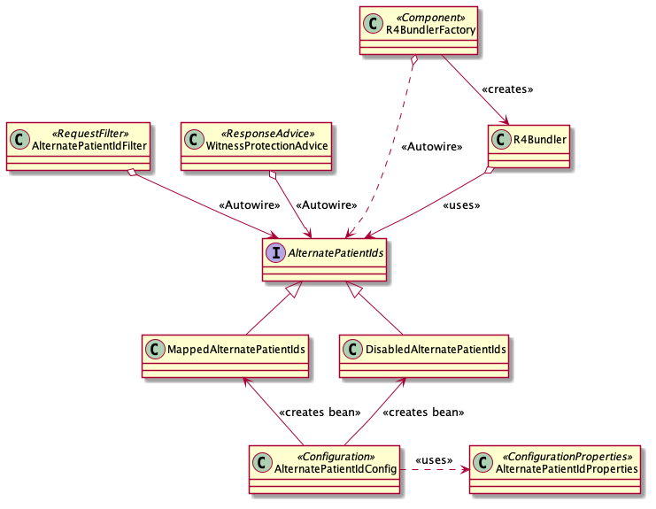
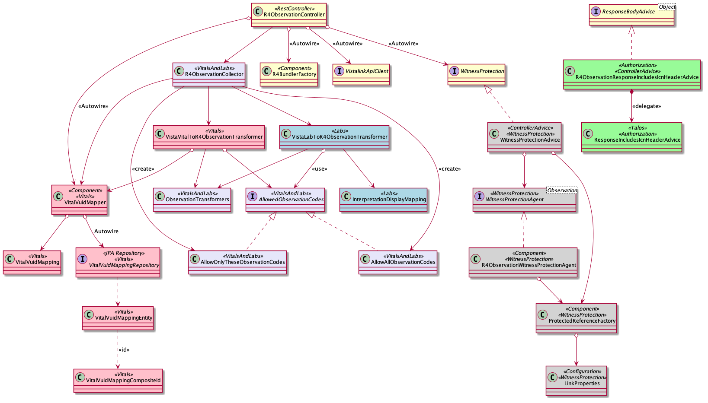

# health-apis-vista-fhir-query

Application for pulling real-time health records from VistA and returning them in a FHIR compliant format.

# Alternate Patient IDs

The _Alternate Patient IDs_ feature supports testing in lower environments. In lower environments it is difficult (impossible) to have a set of patient IDs that work across the different systems, i.e. authentication, VistA, MPI, or Data Query. To enable testing, VFQ's _Alternate Patient IDs_ feature allows a _public_ ID to mapped to a _private_ ID for interacting with VistA.

- _Public_ IDs are known to the caller and systems in the interaction hierarchy _before_ VFQ, such as authentication systems. For example, well known test patient `1011537977V693883` is a good public ID.
- _Private_ IDs are know to systems in the interaction hierarchy _after_ VFQ, such as VistA. For example, Lighthouse QA VistA patient `5000000347` is a good private ID.

Here's how it works:

1. VFQ is configured to enable Alternate Patient IDs and provide a mapping between public and private IDs. See [AlternatePatientIdProperties](vista-fhir-query/src/main/java/gov/va/api/health/vistafhirquery/service/config/AlternatePatientIdProperties.java).
1. On each request, VFQ will check to see if the requested patient has been mapped as a Alternate Patient ID. If so, VFQ temporarily swaps the request _public_ patient ID with a mapped _private_ patient ID. The _private_ ID is known to the VistA instances configured for a specific environment, e.g. QA.
1. On each response, VFQ checks paging links and Patient references. If a _private_ patient ID is found, it is replaced with a _public_ ID. By separating response processing from request processing, this ensures the IDs emitted are always _public_ regardless of the request. For example, an Observation read request would not have a patient ID as part of the request. However, patient references would still be updated with their public ID equivalents.

For example,

- `Observation?patient=1011537977V693883` is received
- `VPR GET PATIENT DATA` RPC is invoked for patient `5000000347`
- Links and references in results are modified from `5000000347` to `1011537977V693883`

### Components

- `AlternatePatientIds` is the interface that allows public and private IDs to be swapped. There are two implementations. `DisabledAlternatePatientIds` and `MappedAlternatePatientIds`. Upon start up, the `AlternatePatientIdConfig` will add one `AlternatePatientIds` implementation to the Spring context based on the `AlternatePatientIdsProperties`. The `DisabledAlternatePatientIds` provides a no-op implementation and keeps if/then logic out of the other components.
- The `AlternatePatientIdFilter` is an HTTP servlet filter that is applied to FHIR endpoints. It will update the `HttpServletRequest` object with a modified patient ID type HTTP parameters, swapping public and private IDs. The HTTP parameters that are eligible for swapping are configured via application properties.
- The `R4Bundler` is responsible for producing page links. It must perform the inverse operation of the `AlternatePatientIdFilter` to emit page links in terms of public patient IDs.
- The `WitnessProtectionAdvice` is responsible for producing resource reference links. Like, the `R4Bundler`, it must perform the inverse operation of the `AlternatePatientIdFilter`.
- The `R4Bundler` and `WitnessProtectionAdvice` are invoked in every FHIR response, regardless of the request type and whether the `AlternatePatientIdFilter` has participated in the request.

# Observation

